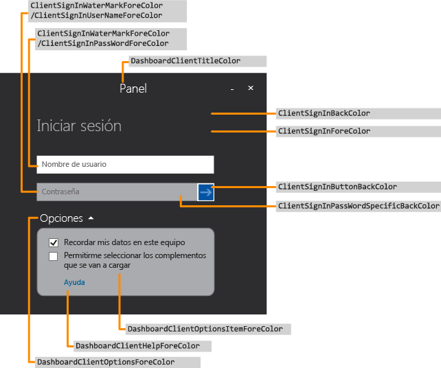
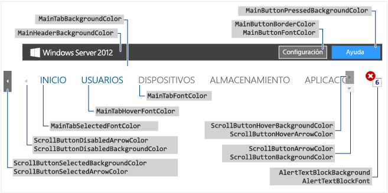
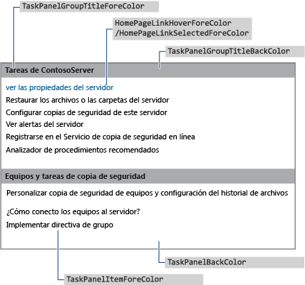
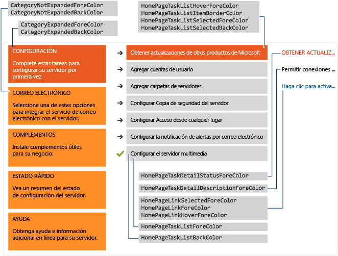

# <a name="change-the-color-scheme-of-the-dashboard-and-launchpad"></a>Cambiar la combinación de colores del Panel y de LaunchPad

>Se aplica a: Windows Server 2016 Essentials, Windows Server 2012 R2 Essentials, Windows Server 2012 Essentials

Para cambiar la combinación de colores del Panel y de LaunchPad, defina los colores que desee utilizar en un archivo con formato XML, instale el archivo en una carpeta del servidor y especifique el nombre del archivo .xml en una entrada del registro.

## <a name="create-the-xml-file"></a>Creación del archivo xml
 En el ejemplo siguiente se muestra el posible contenido del archivo .xml:

```xml
<DashboardTheme xmlns="https://www.microsoft.com/HSBS/Dashboard/Branding/2010">

  <!-- Hex color values overwriting default SKU theme colors -->

    <SplashScreenBackgroundColor HexValue="FFFFFFFF"/>
    <SplashScreenBorderColor HexValue="FF000000"/>
    <MainHeaderBackgroundColor HexValue="FF414141"/>
    <MainTabBackgroundColor HexValue="FFFFFFFF"/>
    <MainTabFontColor HexValue="FF999999"/>
    <MainTabHoverFontColor HexValue="FF0072BC"/>
    <MainTabSelectedFontColor HexValue="FF0072BC"/>
    <MainButtonPressedBackgroundColor HexValue="FF0072BC"/>
    <MainButtonFontColor HexValue="FFFFFFFF"/>
    <MainButtonBorderColor HexValue="FF6E6E6E"/>
    <ScrollButtonBackgroundColor HexValue="FFF0F0F0"/>
    <ScrollButtonArrowColor HexValue="FF999999"/>
    <ScrollButtonHoverBackgroundColor HexValue="FF999999"/>
    <ScrollButtonHoverArrowColor HexValue="FF6E6E6E"/>
    <ScrollButtonSelectedBackgroundColor HexValue="FF6E6E6E"/>
    <ScrollButtonSelectedArrowColor HexValue="FFFFFFFF"/>
    <ScrollButtonDisabledBackgroundColor HexValue="FFF8F8F8"/>
    <ScrollButtonDisabledArrowColor HexValue="FFCCCCCC"/>
    <AlertTextBlockBackground HexValue="FFFFFFFF"/>
    <AlertTextBlockFont HexValue="FF000000"/>
    <FontColor HexValue="FF000000"/>
    <SubTabBarBackgroundColor HexValue="FFFFFFFF"/>
    <SubTabBackgroundColor HexValue="FFFFFFFF"/>
    <SubTabSelectedBackgroundColor HexValue="FF414141"/>
    <SubTabBorderColor HexValue="FF787878"/>
    <SubTabFontColor HexValue="FF787878"/>
    <SubTabHoverFontColor HexValue="FF0072BC"/>
    <SubTabPressedFontColor HexValue="FFFFFFFF"/>
    <ListViewColor HexValue="FFFFFFFF"/>
    <PageBorderColor HexValue="FF999999"/>   
    <LaunchpadButtonHoverBorderColor HexValue="FF6BA0B4"/>
    <LaunchpadButtonHoverBackgroundColor HexValue="FF41788F"/>
    <ClientArrowColor HexValue="FFFFFFFF"/>
    <ClientGlyphColor HexValue="FFFFFFFF"/>
    <SplitterColor HexValue="FF83C6E2"/>
    <HomePageBackColor     HexValue="FFFFFFFF"/>
    <CategoryNotExpandedBackColor HexValue="FFFFB343"/>
    <CategoryExpandedBackColor HexValue="FFF26522"/>
    <CategoryNotExpandedForeColor HexValue="FF2A2A2A"/>
    <CategoryExpandedForeColor HexValue="FFFFFFFF"/>
    <HomePageTaskListForeColor    HexValue="FF2A2A2A"/>
    <HomePageTaskListBackColor HexValue="FFEAEAEA"/>
    <HomePageTaskListHoverForeColor      HexValue="FF2A2A2A"/>
    <HomePageTaskListItemBorderColor     HexValue="FF999999"/>
    <HomePageTaskListSelectedForeColor   HexValue="FFFFFFFF"/>
    <HomePageTaskListSelectedBackColor   HexValue="FFF26522"/>
    <HomePageTaskDetailStatusForeColor   HexValue="FFF26522"/>
    <HomePageTaskDetailDescriptionForeColor     HexValue="FF2A2A2A"/>
    <HomePageLinkForeColor HexValue="FF0072BC"/>
    <HomePageLinkSelectedForeColor HexValue="FF0054A6"/>
    <HomePageLinkHoverForeColor   HexValue="FF0072BC"/>
    <PropertyFormForeColor HexValue="FF2A2A2A"/>
    <PropertyFormTabHoverColor HexValue="FF0072BC"/>
    <PropertyFormTabSelectedColor HexValue="FFFFFFFF"/>
    <PropertyFormTabSelectedBackColor HexValue="FF414141"/>
    <TaskPanelBackColor HexValue="FFFFFFFF"/>
    <TaskPanelItemForeColor HexValue="FF2A2A2A"/>
    <TaskPanelGroupTitleForeColor HexValue="FF2A2A2A"/>
    <TaskPanelGroupTitleBackColor HexValue="FFCCCCCC"/>
    <DashboardClientBackColor HexValue="FF004050"/>
    <DashboardClientTitleColor HexValue="FFFFFFFF"/>
    <DashboardClientOptionsForeColor HexValue="FFFFFFFF"/>
    <DashboardClientOptionsItemForeColor HexValue="FF2A2A2A"/>
    <DashboardClientHelpForeColor HexValue="FF0054A6"/>
    <ClientSignInForeColor HexValue="FFFFFFFF"/>
    <ClientSignInWaterMarkForeColor HexValue="FF999999"/>
    <ClientSignInUserNameForeColor HexValue="FF2A2A2A"/>
    <ClientSignInPassWordSpecificBackColor HexValue="FFCCCCCC"/>
    <ClientSignInButtonBackColor HexValue="FF004050"/>
    <ClientSignInPassWordForeColor HexValue="FF2A2A2A"/>
    <LaunchPadBackColor HexValue="FF004050"/>
    <LaunchPadPageTitleColor HexValue="FFFFFFFF"/>
    <LaunchPadItemForeColor HexValue="FFFFFFFF"/>
  <LaunchPadItemHoverColor HexValue="33FFFFFF"/>
  <LaunchPadItemIconBackgroundColor HexValue="F2004050"/>
</DashboardTheme >

```

> [!IMPORTANT]
>  Los elementos xml deben especificarse en el orden en el que aparecen en el ejemplo anterior.

> [!NOTE]
>  Todos los valores del atributo HexValue son ejemplos de valores hexadecimales para colores. Puede escribir cualquier valor hexadecimal del color que desee utilizar.

 Utilice el Bloc de notas o Visual Studio 2010 para crear el archivo .xml que contenga las etiquetas de las áreas que desee personalizar. El archivo puede tener cualquier nombre, pero la extensión debe ser .xml. Para obtener una descripción de las áreas que se pueden personalizar en el Panel y en LaunchPad, consulte [Áreas del Panel y de LaunchPad que se pueden cambiar](Change-the-Color-Scheme-of-the-Dashboard-and-Launchpad.md#BKMK_Dashboard).

#### <a name="to-install-the-xml-file"></a>Para instalar el archivo .xml

1.  En el servidor, mueva el ratón a la esquina superior derecha de la pantalla y haga clic en **Buscar**.

2.  En el cuadro de búsqueda, escriba **regedit** y después haga clic en la aplicación **Regedit**.

3.  En el panel izquierdo, expanda **HKEY_LOCAL_MACHINE**, **SOFTWARE**, **Microsoft** y finalmente **Windows Server**. Si la clave **OEM** no existe, siga los pasos que se indican a continuación para crearla:

    1.  Haga clic con el botón secundario en **Windows Server**, seleccione **Nuevo** y a continuación haga clic en **Clave**.

    2.  Escriba **OEM** como nombre de la clave.

4.  Haga clic con el botón secundario en **OEM**, seleccione **Nuevo** y a continuación haga clic en **Valor de cadena**.

5.  Escriba **CustomColorScheme** como el nombre de la cadena y, a continuación, presione **Entrar**.

6.  Haga clic con el botón secundario en **CustomColorScheme** en el panel derecho y después haga clic en **Modificar**.

7.  Haga clic en el nombre del archivo y, a continuación, en **Aceptar**.

8.  Copie el archivo en %programFiles%\Windows Server\Bin\OEM. Si la clave RemoteUserPortal no existe, créela.

##  <a name="dashboard-and-launchpad-areas-that-can-be-changed"></a><a name="BKMK_Dashboard"></a>Áreas del panel y de Launchpad que se pueden cambiar
 Esta sección incluye ejemplos de áreas del Panel y el Launchpad que se pueden personalizar.

### <a name="examples"></a>Ejemplos

####  <a name="figure-1-sign-in-page-of-the-dashboard"></a><a name="BKMK_Figure1"></a>Figura 1: Página de inicio de sesión del panel
 

####  <a name="figure-2-launchpad"></a><a name="BKMK_Figure2"></a>Figura 2: launchpad
 

####  <a name="figure-3-sign-in-page-of-the-launchpad"></a><a name="BKMK_Figure3"></a>Figura 3: Página de inicio de sesión de Launchpad
 

####  <a name="figure-4-dashboard-text"></a><a name="BKMK_Figure4"></a>Figura 4: texto del panel
 

####  <a name="figure-5-subtab-border"></a><a name="BKMK_Figure5"></a>Figura 5: borde de subficha
 

####  <a name="figure-6-task-pane"></a><a name="BKMK_Figure6"></a>Figura 6: panel de tareas
 

####  <a name="figure-7a-product-splash-screen"></a><a name="BKMK_Figure9"></a>Figura 7A: pantalla de presentación del producto
 

#### <a name="figure-7b-home-page"></a>Figura 7b: Página principal
 

## <a name="see-also"></a>Consulte también
 [Crear y personalizar la imagen](Creating-and-Customizing-the-Image.md) [personalizaciones adicionales](Additional-Customizations.md) [preparar la imagen para probar la implementación de](Preparing-the-Image-for-Deployment.md) [la experiencia del cliente](Testing-the-Customer-Experience.md)